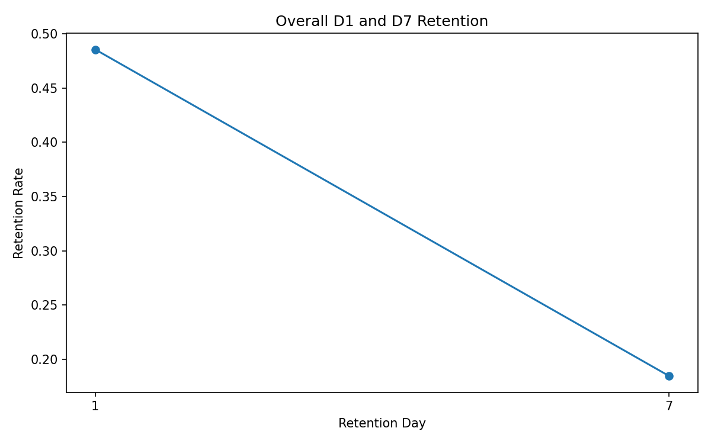
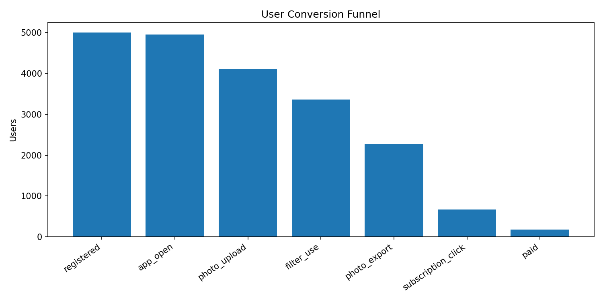
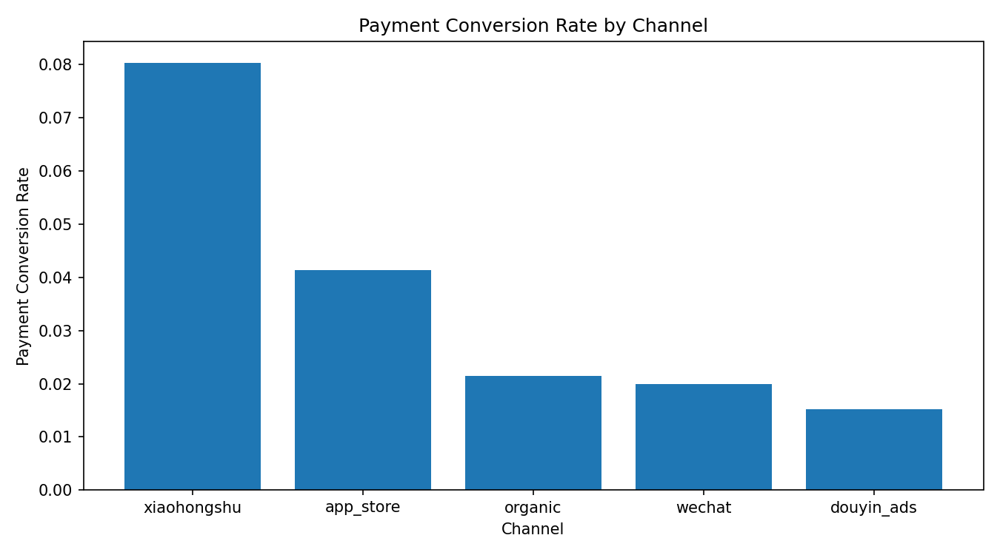
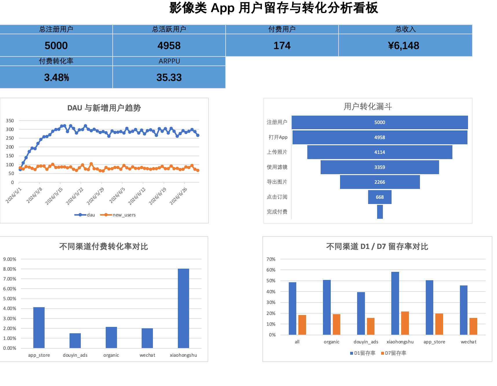

# Photo App User Retention & Conversion SQL Analysis｜影像类 App 用户留存与转化分析项目

SQL and Excel-based user retention and conversion analysis project for a photo editing app.

这是一个面向数据分析、经营分析、BI 报表、数据运营分析岗位的求职作品集项目。项目使用模拟数据还原影像类 App 的注册、活跃、功能使用、订阅点击和付费转化路径，并通过 SQL 与 Excel 完成核心指标分析。

## 1. 项目定位

本项目模拟一个影像类 App，用户可以完成以下行为：

```text
注册 → 打开 App → 上传照片 → 使用滤镜 → 导出图片 → 分享图片 → 点击订阅 → 付费购买会员
```

项目目标是分析：

- 不同渠道用户质量差异；
- 用户次日和 7 日留存表现；
- 核心功能使用路径中的转化流失；
- 订阅点击和付费转化情况；
- 哪些功能行为与付费转化关系更强。

## 2. 数据规模

- 注册用户数：5,000
- 行为事件数：34,482
- 订单数：175
- 时间范围：2026-05-01 至 2026-06-30

## 3. 仓库结构

```text
photo-app-user-retention-sql-analysis/
├── README.md
├── data_dictionary.md
├── requirements.txt
├── .gitignore
├── github_upload_steps.md
├── data_sample/
│   ├── users.csv
│   ├── events.csv
│   ├── orders.csv
│   ├── daily_metrics.csv
│   ├── retention_summary.csv
│   ├── funnel_summary.csv
│   └── channel_summary.csv
├── sql/
│   ├── 01_create_tables.sql
│   ├── 02_dau_new_users.sql
│   ├── 03_retention_analysis.sql
│   ├── 04_funnel_analysis.sql
│   ├── 05_payment_analysis.sql
│   ├── 06_channel_analysis.sql
│   └── 07_feature_payment_comparison.sql
├── src/
│   └── generate_sample_data.py
├── figures/
│   ├── retention_curve.png
│   ├── conversion_funnel.png
│   └── channel_comparison.png
├── excel_dashboard/
│   ├── dashboard_guide.md
│   └── dashboard_screenshots/
└── report.md
```

## 4. SQL 分析内容

| 文件 | 分析内容 |
|---|---|
| `01_create_tables.sql` | 建表语句 |
| `02_dau_new_users.sql` | DAU、新增用户、活跃中新用户占比 |
| `03_retention_analysis.sql` | 次日留存率、7日留存率 |
| `04_funnel_analysis.sql` | 注册到付费的转化漏斗 |
| `05_payment_analysis.sql` | 付费转化率、收入、ARPPU、复购率 |
| `06_channel_analysis.sql` | 不同渠道用户质量对比 |
| `07_feature_payment_comparison.sql` | 功能使用与付费转化关系分析 |

## 5. 示例图表

### 留存分析



### 转化漏斗



### 渠道付费转化对比



## Excel Dashboard Preview



## 6. 关键业务结论

基于模拟样例数据，可得到以下业务分析结论：

1. 小红书和 App Store 渠道用户整体质量较高，留存和付费转化表现更好；
2. 抖音广告渠道注册规模较大，但留存和付费转化偏弱，需要关注投放人群质量；
3. 从导出图片到订阅点击环节存在明显流失，可在导出成功页增加会员权益提示；
4. 使用滤镜和导出图片的用户付费转化明显高于未使用用户，说明核心功能体验与付费意愿相关；
5. iOS 用户可进一步拆分分析 ARPPU 与付费转化，辅助会员定价和权益设计。

## 7. 数据说明与隐私声明

本仓库所有数据均为模拟生成，仅用于求职作品集展示，不包含真实用户数据、公司数据或任何个人隐私信息。

本仓库所有数据均为模拟生成，仅用于求职作品集展示，不包含真实用户数据、公司数据或任何个人隐私信息。
